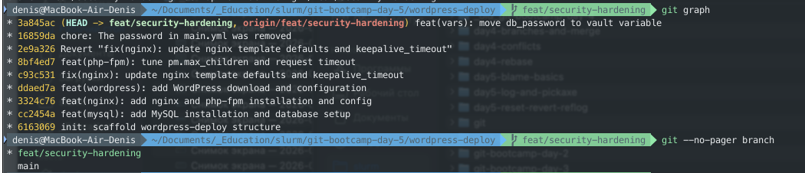
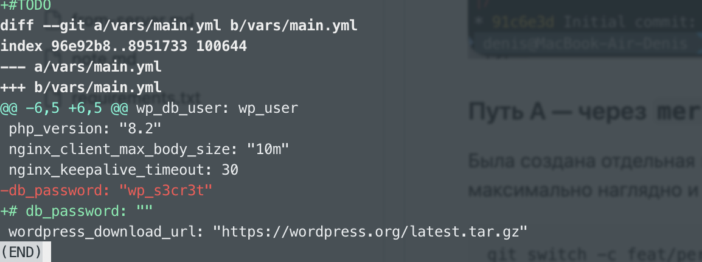
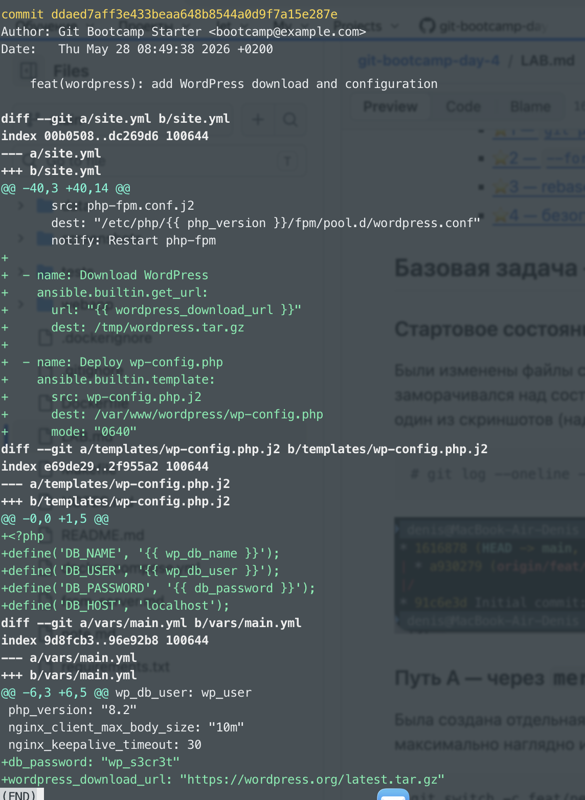
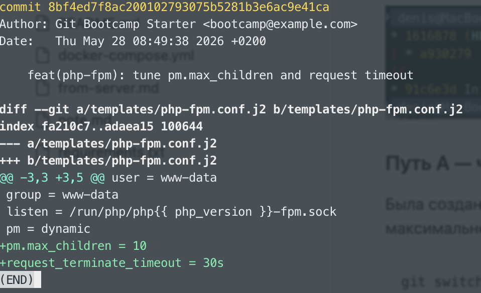

# LAB — день 5

## Содержание
- [LAB — день 5](#lab--день-5)
  - [Содержание](#содержание)
  - [Базовая задача — `01-history-detective`](#базовая-задача--01-history-detective)
    - [Часть 1 — pickaxe и blame](#часть-1--pickaxe-и-blame)
    - [Часть 2 — reset --hard и reflog](#часть-2--reset---hard-и-reflog)
    - [Часть 3 — revert](#часть-3--revert)
  - [⭐1 — удалённая ветка](#1--удалённая-ветка)
  - [](#)
  - [⭐2 — pickaxe с regexp (`-G`)](#2--pickaxe-с-regexp--g)


> Скопируйте этот файл в `LAB.md` в корне вашего репозитория `git-bootcamp-day-5` и заполните по ходу работы.

## Базовая задача — `01-history-detective`

### Часть 1 — pickaxe и blame

**Коммит с паролем БД (`wp_s3cr3t`):**

- Хеш: `ddaed7a`
- Что изменилось (1–2 предложения): в этом коммите было добавлено несколько строк в `vars/main.yaml`

```bash
# git log -S 'wp_s3cr3t' --oneline
# git show ddaed7a
```

```bash
diff --git a/vars/main.yml b/vars/main.yml
index 9d8fcb3..96e92b8 100644
--- a/vars/main.yml
+++ b/vars/main.yml
@@ -6,3 +6,5 @@ wp_db_user: wp_user
 php_version: "8.2"
 nginx_client_max_body_size: "10m"
 nginx_keepalive_timeout: 30
+db_password: "wp_s3cr3t"
+wordpress_download_url: "https://wordpress.org/latest.tar.gz"
```

**Строка `client_max_body_size` (blame):**

```bash
# git blame -L '/client_max_body_size/,+3' templates/nginx.conf.j2
```

- Автор из `git blame`: `Git Bootcamp Starter`
- Хеш коммита: `c93c5315`
- Кратко, что сделал этот коммит: update nginx template defaults and keepalive_timeout. В файле `templates/nginx.conf.j2`
вместо строк
```bash
    client_max_body_size {{ nginx_client_max_body_size }};
    keepalive_timeout {{ nginx_keepalive_timeout }};
```
добавили эти
```bash
    client_max_body_size 64m;
    keepalive_timeout 65;
```
то есть убрали переменные


### Часть 2 — reset --hard и reflog

- Хеш HEAD **до** `reset --hard HEAD~2`: `8bf4ed7`
- Хеш из `reflog`, на который откатывались при восстановлении: `#TODO`
- Полная команда восстановления: `git reset --hard 8bf4ed`

```bash
# git reset --hard 8bf4ed7
Указатель HEAD сейчас на коммите 8bf4ed7 feat(php-fpm): tune pm.max_children and request timeout
```

```bash
# git graph
* 8bf4ed7 (HEAD -> main, origin/main, origin/HEAD) feat(php-fpm): tune pm.max_children and request timeout
* c93c531 fix(nginx): update nginx template defaults and keepalive_timeout
* ddaed7a feat(wordpress): add WordPress download and configuration
* 3324c76 feat(nginx): add nginx and php-fpm installation and config
* cc2454a feat(mysql): add MySQL installation and database setup
* 6163069 init: scaffold wordpress-deploy structure
````

```bash
# git --no-pager reflog| head -10
8bf4ed7 HEAD@{0}: reset: moving to 8bf4ed7
ddaed7a HEAD@{1}: reset: moving to HEAD~2
8bf4ed7 HEAD@{2}: clone: from /Users/denis/Documents/_Education/slurm/git-bootcamp-day-5/wordpress-deploy.bundle
```

### Часть 3 — revert

- Хеш отменённого коммита (`fix(nginx): update nginx template defaults and keepalive_timeout`): `c93c531`
- Заголовок revert-коммита (как в `git log --oneline -1` после revert): `7a5e35d`
- Хеш security-коммита после ротации пароля: `0715745`
- Первая строка body этого security-коммита: `chore(security): removed db password`
- Как теперь выглядит строка в `vars/main.yml` вместо открытого пароля:
```yaml
site_name: wordpress-demo
wp_db_name: wordpress
wp_db_user: wp_user
php_version: "8.2"
nginx_client_max_body_size: "10m"
nginx_keepalive_timeout: 30
# db_password: ""
wordpress_download_url: "https://wordpress.org/latest.tar.gz"

```

**Revert vs reset --hard (2–3 предложения, своими словами):**

`Revert` безопасен для отмены коммитов, которые уже были запушены в общую ветку: он создаёт новый коммит с обратными изменениями, не трогая историю, поэтому у коллег не возникает проблем при pull.

`Reset --hard` уместен только на локальной, ещё не запушенной ветке — он безвозвратно удаляет коммиты и правки из истории.

Если после `reset --hard` сделать `push --force`, история перезаписывается, и всем остальным разработчикам придётся вручную приводить свои локальные ветки в соответствие (например, через `git fetch --force`), что чревато потерей их работы.

---

## ⭐1 — удалённая ветка

Из `git reflog` взял эту строчку
`3a845ac HEAD@{1}: checkout: moving from main to feat/security-hardening`
Эта первая строка в ветке, поэтому взял именно ее

```bash
# git reflog | head -3
d886e0f (HEAD -> feat/security-hardening, origin/feat/security-hardening) HEAD@{0}: commit: docs: added some fake lines for commit
3a845ac HEAD@{1}: checkout: moving from main to feat/security-hardening
a495afd (origin/main, origin/HEAD, main) HEAD@{2}: checkout: moving from recovery to main
```
Состояние при удалении ветки




Итоговый результат


---

## ⭐2 — pickaxe с regexp (`-G`)

```bash
# git --no-pager log -S 'wp_s3cr3t' --oneline
0715745 chore(security): removed db password
ddaed7a feat(wordpress): add WordPress download and configuration
```

**Команда с `-G`, находящая тот же коммит, что и `-S 'wp_s3cr3t'`:**

```bash
# git --no-pager log -G 'wp_s3cr3t' --oneline -- vars/main.yml
0715745 chore(security): removed db password
ddaed7a feat(wordpress): add WordPress download and configuration
```
Найдено два коммита - удаление и добавление пароля:





**Команда с `-G`, находящая коммит `feat(php-fpm)` через regex на обе директивы:**

```bash
# git --no-pager log -G 'wp_s3cr3t|pm.max_children|request_terminate_timeout' --oneline
0715745 chore(security): removed db password
8bf4ed7 feat(php-fpm): tune pm.max_children and request timeout
ddaed7a feat(wordpress): add WordPress download and configuration
```

**Разница `-S` и `-G` на примере из вашей истории (2–3 предложения):**

Разница в том, что -S ищет коммиты, в которых количество вхождений искомой строки изменилось (появилась или исчезла), а -G ищет коммиты, где в патче появляется или удаляется строка, соответствующая регулярному выражению, даже если общее количество вхождений не изменилось.
Но в моём случае реально сработало только последний вывод, первая задача выдавала одинаковый результат при разных ключах.

